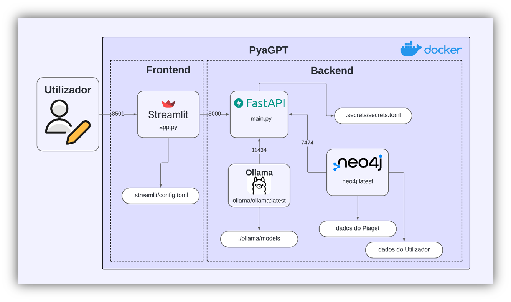

# PyaGPT - Virtual Assistant of Instituto Piaget

The **PyaGPT** project is an innovative application that leverages various technologies to create a virtual assistant specialized in providing information about Instituto Piaget. The user interface is developed using Streamlit, while the backend is managed by FastAPI, ensuring efficient communication between the system's components. The Neo4j graph database stores all essential information about the institute, such as contacts and courses, as well as user-specific data, like personal information and class schedules, allowing for contextual and personalized responses. Integration with the Ollama API enables the use of advanced language models to answer user queries more accurately and relevantly. PyaGPT is thus an interactive, easy-to-use, and efficient tool, ideal for facilitating access to institutional information about Piaget.

## Architecture

The following diagram shows the architecture of the PyaGPT system:

## Technologies 

- **User Interface**: Developed with **Streamlit**, providing an interactive and user-friendly interface.
- **Backend**: Managed by **FastAPI**, ensuring fast and efficient communication between system components.
- **Database**: Uses the **Neo4j** graph database to store essential information about the institute, such as contacts and courses, as well as user-specific data, such as personal information and class schedules. This allows the system to provide contextual and personalized responses.
- **Language Models**: Integrated with the **Ollama API** to use advanced language models, offering precise and relevant answers to user queries.

## Example Usage: PyaGPT

Below is an example of the PyaGPT chatbot in action:


## Example Usage: Multimodal Model

### Image Analysis
The multimodal model can analyze images and provide descriptions. Example:


### PDF Analysis
It can also analyze PDFs and extract information. Example:


## How to Use PyaGPT

### Clone the PyaGPT Repository

To get the source code of the PyaGPT project, execute the following command in your shell:

```bash
git clone https://github.com/gui-gaspar/PyaGPT
```

### Install Ollama Models

The Ollama models must be installed beforehand to ensure PyaGPT works correctly. We recommend installing the following models:

- [**Llama 3.1**](https://ollama.com/library/llama3.1): For general chat interactions.
- [**Llava**](https://ollama.com/library/llava): For image and PDF analysis.

#### Installation Commands:

To install the models, use the following commands:

```bash
ollama run llama3.1
ollama run llava
```

After installation, locate the directory where the models were installed on your system:

- **Windows**: `C:\Users\USER\.ollama\models` (replace "USER" with your username).
- **Linux**: `/usr/share/ollama/.ollama/models`

Copy the `blobs` and `manifests` folders to the project directory under `ollama\models`. This directory should be created at the root of the PyaGPT project if it does not exist. This step is essential for the models to be loaded correctly during execution.

### Run the Project

To run PyaGPT, follow one of the procedures below:

1. In the main project directory, execute:
   ```bash
   docker-compose up --build
   ```

2. Alternatively, use the script located at the `root` of the project:
   ```bash
   run_docker.bat
   ```

### Import Data into the Neo4j Database

The Neo4j data should be loaded using the SQL scripts available in the `sql` folder: 

1. `importar_dados.sql`
2. `importar_relacoes.sql`

Simply copy their content into the Neo4j `prompt` to import all data related to Instituto Piaget and user-specific information.
